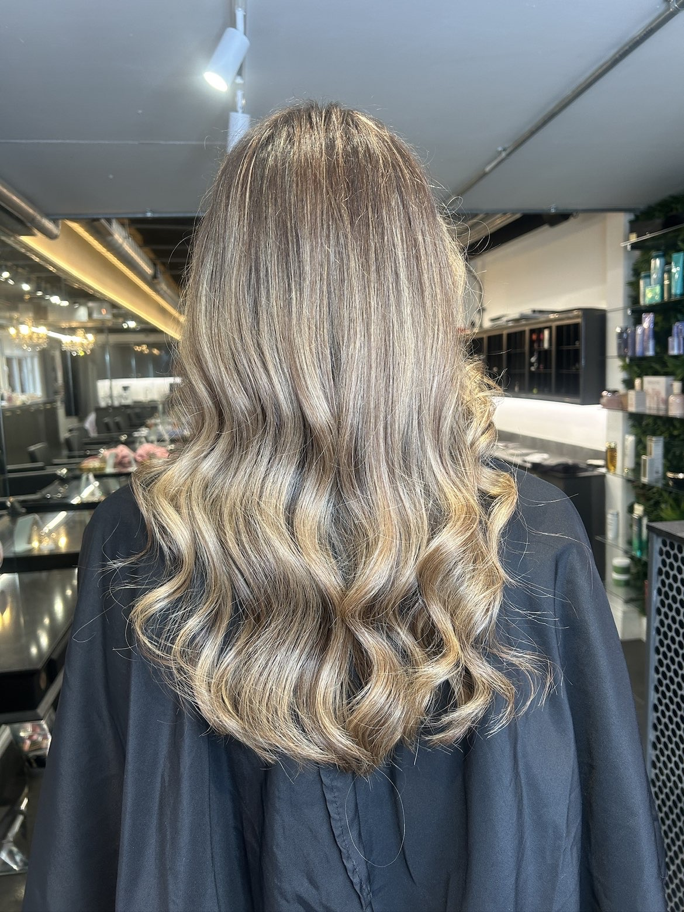
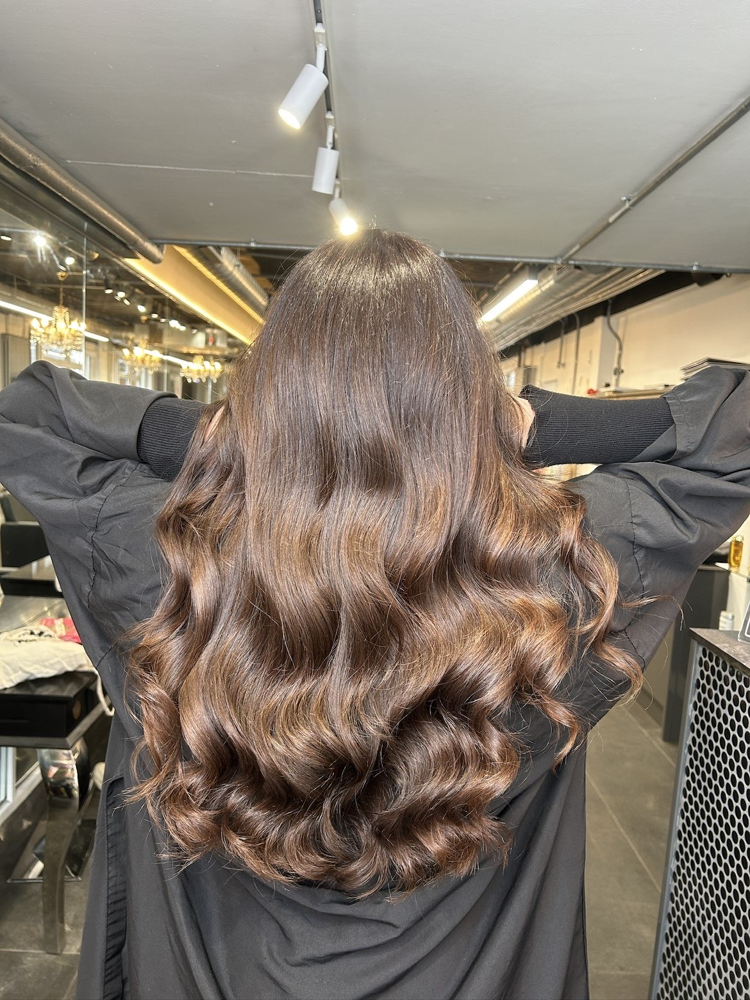
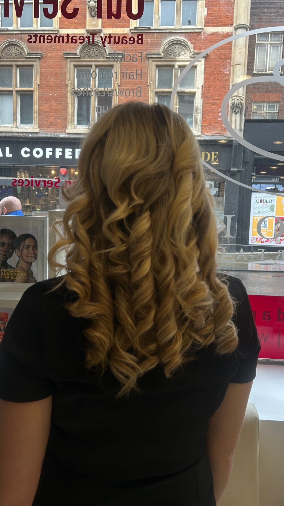

# Maddison Shepherd - Editorial Hair Portfolio Website

An Awwwards-inspired, high-end one-page website for a hair stylist and colourist. Built as a polished creative portfolio piece with cinematic motion, editorial typography, luxury beauty styling, responsive layouts, and search-friendly content for discovery.



## Project Snapshot

**Maddison Shepherd - Hair Stylist & Colourist** is a static HTML, CSS, and JavaScript website designed to feel like a boutique beauty editorial: warm, tactile, confident, and image-led. It showcases balayage, blondes, gloss colour, foilyage, cuts, waves, transformations, booking calls to action, and a refined service flow.

The goal is simple: make the site feel premium enough for clients, memorable enough for a creative portfolio, and searchable enough to communicate the craft behind the build.

## Experience Highlights

- **Awwwards-style visual direction** with oversized serif typography, editorial spacing, soft luxury colour grading, custom cursor, loader, marquee, scroll progress, and refined micro-interactions.
- **Portfolio-first layout** with image-led case cards for bronde balayage, chocolate brunette gloss, honey blonde curls, and copper brunette styling.
- **Conversion-focused booking journey** with sticky navigation, smooth anchor scrolling, a services section, and clear email/Instagram actions.
- **Responsive static build** that works without a framework, build tool, CMS, or server.
- **Accessible motion handling** with reduced-motion support and graceful fallbacks.
- **SEO-aware copy structure** using descriptive headings, service keywords, image alt text, meta descriptions, and searchable README content.

## What This Shows I Can Do

- Design luxury, editorial websites for beauty, lifestyle, fashion, and personal brands.
- Build responsive landing pages and portfolios with HTML, CSS, and vanilla JavaScript.
- Create immersive front-end interactions: custom cursors, page loaders, parallax, reveal animations, marquees, counters, scroll progress, and hover states.
- Turn a small brand brief into a complete online presence with visual direction, copy, layout, services, calls to action, and deployment-ready files.
- Balance polish and performance in a fully static site that can be hosted anywhere.

## Visual Preview

| Portfolio Detail | Hair Transformation | Editorial Gallery |
|---|---|---|
|  |  |  |

## Search Keywords

hair stylist website, hair colourist portfolio, beauty salon website design, luxury hair portfolio, balayage website, blonde specialist website, gloss toner website, foilyage services, hair transformation gallery, editorial web design, Awwwards inspired website, creative developer portfolio, responsive HTML CSS JavaScript website, vanilla JavaScript animations, luxury beauty landing page, personal brand website, booking landing page, static website design, front end developer portfolio, interactive portfolio website

## Built With

- HTML5
- CSS3
- Vanilla JavaScript
- Google Fonts: Fraunces and Inter
- Lenis smooth scrolling loaded from CDN with a native scroll fallback
- Static assets in `images/`

## Key Files

- `index.html` - page structure, SEO metadata, sections, copy, and calls to action
- `styles.css` - full visual system, responsive layout, animation styling, and editorial art direction
- `main.js` - loader, smooth scrolling, custom cursor, reveal animations, parallax, marquee, counters, and image fallbacks
- `images/` - portfolio photography used across the hero and gallery

## Add Or Replace Photos

Drop Maddison's four photos into the `images/` folder with these exact names:

| File | Used For |
|---|---|
| `images/img-1.jpg` | Hero image and Bronde Balayage portfolio card |
| `images/img-2.jpg` | Liquid Chocolate brunette gloss portfolio card |
| `images/img-3.jpg` | Golden Hour honey blonde curls portfolio card |
| `images/img-4.jpg` | Warm Copper Brunette sleek finish portfolio card |

Portrait photos work best in the gallery because the cards use editorial 4:5 and 5:4 crops.

## Run Locally

```bash
cd maddison-shepherd
python3 -m http.server 4321
```

Open `http://localhost:4321` in your browser.

You can also open `index.html` directly, though a local server is better for testing browser behavior consistently.

## Personalise The Site

- **Instagram and email:** search `index.html` for `@maddison.hair`, `instagram.com`, and `hello@maddisonshepherd.com`.
- **Location:** update `Bedfordshire - Hair Stylist & Colourist` in the hero eyebrow.
- **Services:** edit the `<ul class="svc-list">` section.
- **Prices:** uncomment and update the hidden service price spans if needed.
- **Stats:** edit the `data-count` values in the `.stats` section.
- **SEO:** update the `<title>`, meta description, Open Graph title, and Open Graph description in `index.html`.

## Deploy

This is a fully static site, so it can be deployed anywhere:

- Netlify
- Vercel
- GitHub Pages
- Cloudflare Pages
- Any static web host

No database, backend, or build step is required.

## Portfolio Positioning

This project is ideal as a showcase for **creative front-end development**, **beauty brand web design**, **interactive landing pages**, **luxury personal branding**, and **static website builds**. It demonstrates how a simple service business can be turned into a premium digital experience with strong visuals, focused copy, and polished browser-native interactions.
